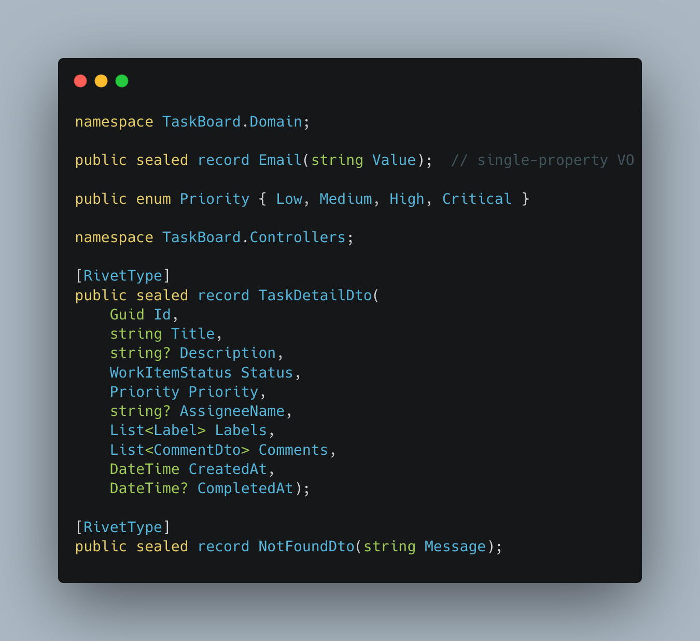
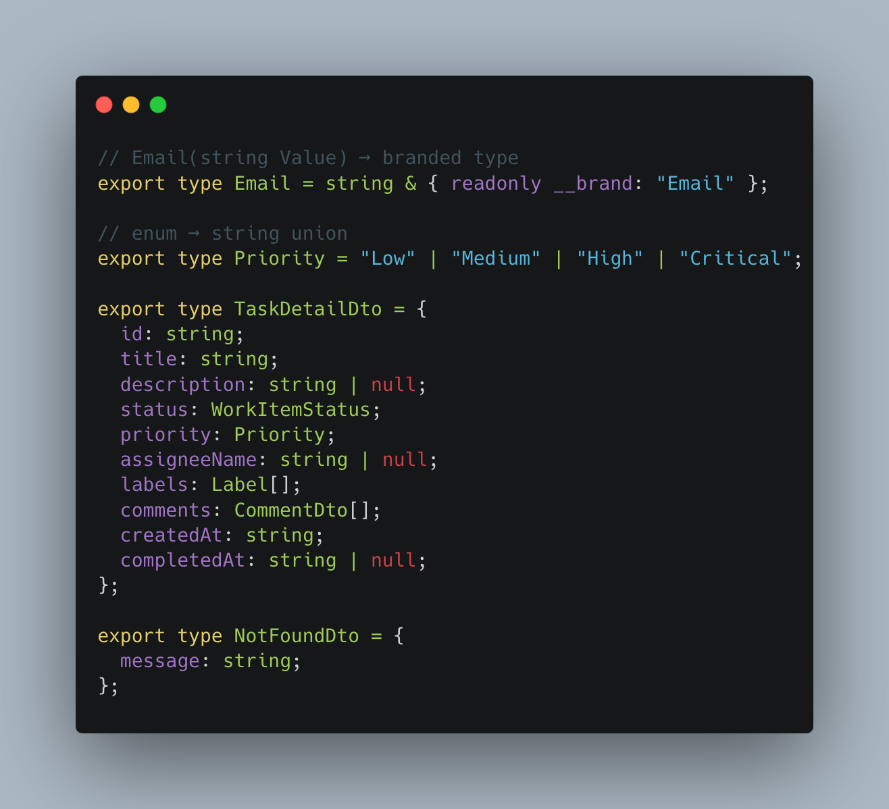
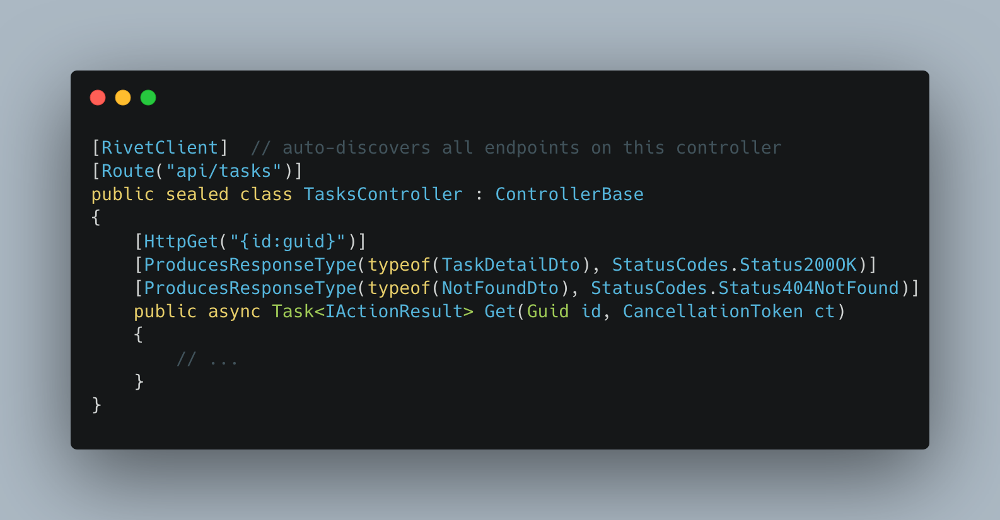
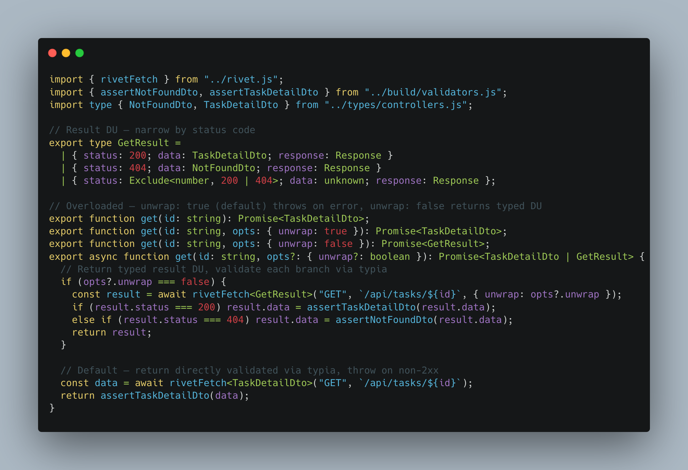

<p align="center">
  
  <h1 align="center">Rivet</h1>
  <p align="center">
    <a href="https://www.nuget.org/packages/Rivet.Attributes"></a>
    <a href="https://www.nuget.org/packages/dotnet-rivet"></a>
    <a href="https://github.com/maxdavids/rivet/blob/main/LICENSE"></a>
  </p>
</p>

End-to-end type safety between .NET and TypeScript. No drift, no schema files, no codegen config.

Rivet works in three modes — use whichever fits your team:

| Source of truth | Command | What it produces |
|---|---|---|
| **C# contracts** | `dotnet rivet --project Api.csproj` | TS types, typed client, validators, OpenAPI spec |
| **C# controllers** | `dotnet rivet --project Api.csproj` | Same — contracts and controllers are interchangeable |
| **OpenAPI spec** | `dotnet rivet --from-openapi spec.json` | C# contracts + DTOs (feed back into row 1) |

Mark your types. Define your endpoints. One command. Full-stack type safety.

### Your C# types...



### ...become TypeScript types



### Your controllers...



### ...become a typed client with runtime validation



## Why

[tRPC](https://trpc.io) and [oRPC](https://orpc.unnoq.com) give you end-to-end type safety when your server is
TypeScript. Rivet gives you the same DX when your server is .NET.

Unlike OpenAPI-based generators (NSwag, Kiota, Kubb), Rivet reads Roslyn's full type graph — nullable annotations,
sealed records, string enum unions, generic type parameters — and produces richer TypeScript types than any JSON schema
intermediary can represent.

Rivet is not just a client generator. Any C# type marked with `[RivetType]` becomes a TypeScript type — whether or not
it appears in an endpoint. Commands, results, value objects, DTOs — if your frontend and backend need to agree on a
shape, mark it once in C# and it appears in your generated types. The types are the primary output; the client is a
bonus.

## What it produces

```
generated/rivet/
├── types/
│   ├── index.ts              # barrel: export * as common, export * as domain, ...
│   ├── common.ts             # types referenced across multiple groups
│   ├── domain.ts             # types grouped by C# namespace
│   └── contracts.ts
├── rivet.ts                  # configureRivet(), rivetFetch, RivetError, RivetResult
├── client/
│   ├── index.ts              # barrel: export * as tasks, export * as members
│   ├── tasks.ts              # overloaded functions with typed error responses
│   └── members.ts            # one file per controller
├── validators.ts             # typia source (inert until compiled)
└── build/                    # (after --compile)
    ├── validators.js          # runtime assertion functions
    └── validators.d.ts
```

Types are split by C# namespace. Types referenced across multiple groups are promoted to `common.ts`. Barrel exports
let consumers import from `types/index.js` — the grouping is purely for navigating the generated code.

## Type mapping

| C#                                                        | TypeScript                               |
|-----------------------------------------------------------|------------------------------------------|
| `string`, `Guid`                                          | `string`                                 |
| `int`, `long`, `decimal`, `double`, `uint`, `ulong`       | `number`                                 |
| `bool`                                                    | `boolean`                                |
| `DateTime`, `DateTimeOffset`, `DateOnly`                  | `string`                                 |
| `T?` (nullable value/ref)                                 | `T \| null`                              |
| `List<T>`, `T[]`, `IEnumerable<T>`, `IReadOnlyList<T>`    | `T[]`                                    |
| `Dictionary<string, T>`, `IReadOnlyDictionary<string, T>` | `Record<string, T>`                      |
| `sealed record`                                           | `type { ... }` (transitive discovery)    |
| `enum` (with `JsonStringEnumConverter`)                   | `export type Status = "A" \| "B"`        |
| `PagedResult<T>` (generic record)                         | `PagedResult<T>`                         |
| `JsonElement`, `JsonNode`                                 | `unknown`                                |
| `JsonObject`                                              | `Record<string, unknown>`                |
| `JsonArray`                                               | `unknown[]`                              |
| `Email(string Value)` (single-property VO)                | `string & { readonly __brand: "Email" }` |

## Dependencies

**Your project:**

- `Rivet.Attributes` NuGet package — marker attributes and contract builders, zero dependencies

**The CLI tool:**

- .NET 8+ SDK
- `dotnet-rivet` global tool
- Node.js on PATH (only required for `--compile`)

## Quick start

### 1. Install

```bash
# Add the attributes to your API project
dotnet add package Rivet.Attributes

# Install the CLI tool
dotnet tool install --global dotnet-rivet
```

### 2. Mark your types and endpoints

```csharp
[RivetType]  // explicit — for types not reachable from any endpoint
public sealed record TaskItem(Guid Id, string Title, Priority Priority, Email Author);

[RivetClient] // auto-discovers all public HTTP methods on this controller
[Route("api/tasks")]
public sealed class TasksController : ControllerBase
{
    [HttpPost]
    [ProducesResponseType(typeof(CreateTaskResult), StatusCodes.Status201Created)]
    public async Task<IActionResult> Create(
        [FromBody] CreateTaskCommand command,
        CancellationToken ct)
    {
        // ...
    }
}
```

Request types (`[FromBody]`), response types (`[ProducesResponseType]` or typed returns), and everything they reference
(enums, VOs, nested records) are discovered transitively — `[RivetType]` is only needed for types not reachable from
any endpoint.

### 3. Generate

```bash
dotnet rivet --project path/to/Api.csproj --output ../ui/generated/rivet
```

### 4. Use

```typescript
import {configureRivet} from "~/generated/rivet/rivet";
import {tasks} from "~/generated/rivet/client";

// Configure once at app startup
configureRivet({
  baseUrl: "http://localhost:5000",
  headers: () => ({Authorization: `Bearer ${token}`}),
});

// Returns T directly — throws RivetError on non-2xx
const result = await tasks.create({
  title: "Fix the thing",
  priority: "High",
  author: "max@example.com" as Email,
});
console.log(result.id);        // string
console.log(result.createdAt); // string
```

### 5. Optional: runtime validation

```bash
dotnet rivet --project path/to/Api.csproj --output ../ui/generated/rivet --compile
```

Compiles [typia](https://typia.io) validators and re-emits the client with runtime type assertions at every fetch
boundary. If the server sends unexpected data, you get a clear error instead of a silent `undefined` three components
later.

## Endpoint discovery

Two attributes control which methods become client endpoints:

**`[RivetClient]`** — class-level. All public methods with an HTTP attribute (`[HttpGet]`, `[HttpPost]`, etc.) become
endpoints automatically. No per-method annotation needed. Best for controllers where every action is an API endpoint.

**`[RivetEndpoint]`** — method-level. Explicit opt-in per method. Works on any class, no base class required. Use when
only some methods on a class should be exposed, or for standalone endpoints outside the controller pattern:

```csharp
[RivetClient]
[Route("api/tasks")]
public sealed class TasksController : ControllerBase
{
    // Included — public method with HTTP attribute on a [RivetClient] class
    [HttpGet("{id:guid}")]
    public async Task<ActionResult<TaskDetailDto>> Get(Guid id, CancellationToken ct) { ... }

    // Excluded — no [RivetEndpoint], and this is a helper not an action
    public IActionResult RedirectToTask(Guid id) => RedirectToAction(nameof(Get), new { id });
}

// Standalone endpoint — no controller, no base class
public static class HealthCheck
{
    [RivetEndpoint]
    [HttpGet("/api/health")]
    public static Task<HealthDto> Get() => Task.FromResult(new HealthDto("ok"));
}
```

Both attributes can coexist — if a method matches both `[RivetClient]` (via its class) and `[RivetEndpoint]`, it is
emitted once.

### Contract-driven endpoints

Instead of annotating controllers, you can define endpoint shapes in a static contract class. Rivet reads it at
generation time for TS codegen, and your controllers use `.Invoke()` for type-safe execution at runtime:

```csharp
// Contract — pure Rivet, no ASP.NET dependency
[RivetContract]
public static class MembersContract
{
    public static readonly EndpointBuilder<List<MemberDto>> List =
        Endpoint.Get<List<MemberDto>>("/api/members")
            .Description("List all team members");

    public static readonly EndpointBuilder<InviteMemberRequest, InviteMemberResponse> Invite =
        Endpoint.Post<InviteMemberRequest, InviteMemberResponse>("/api/members")
            .Description("Invite a new team member")
            .Status(201)
            .Returns<InviteMemberResponse>(422, "Validation failed")
            .Secure("admin");

    public static readonly EndpointBuilder Remove =
        Endpoint.Delete("/api/members/{id}")
            .Description("Remove a team member")
            .Returns<MemberDto>(404, "Member not found")
            .Secure("admin");
}

// Controller — thin wrapper, compiler enforces input/output types
[Route("api/members")]
public sealed class MembersController : ControllerBase
{
    [HttpGet]
    public async Task<IActionResult> List(CancellationToken ct)
        => (await MembersContract.List.Invoke(async () =>
        {
            // Must return List<MemberDto> — compile error if wrong
            return new List<MemberDto>();
        })).ToActionResult();

    [HttpPost]
    public async Task<IActionResult> Invite(
        [FromBody] InviteMemberRequest request, CancellationToken ct)
        => (await MembersContract.Invite.Invoke(request, async req =>
        {
            // req is InviteMemberRequest, must return InviteMemberResponse
            return new InviteMemberResponse(Guid.NewGuid());
        })).ToActionResult();
}
```

`Invoke` returns `RivetResult<T>` — a framework-agnostic result with status code and typed data. You provide a
one-liner bridge to convert it to your framework's response type:

```csharp
// Write once per project
public static class RivetExtensions
{
    public static IActionResult ToActionResult<T>(this RivetResult<T> result)
        => new ObjectResult(result.Data) { StatusCode = result.StatusCode };

    public static IActionResult ToActionResult(this RivetResult result)
        => new StatusCodeResult(result.StatusCode);
}
```

This generates the exact same typed client as attribute-based controllers — same overloads, same discriminated unions,
same validators. Contracts and controller attributes can coexist in the same project; if both define the same endpoint
(matching controller name + method name), the contract wins.

**Factory methods:** `Endpoint.Get`, `.Post`, `.Put`, `.Patch`, `.Delete` — each with three overloads:

| Overload                                        | Meaning                                |
|-------------------------------------------------|----------------------------------------|
| `Endpoint.Get<TInput, TOutput>(route)`          | Input type + output type               |
| `Endpoint.Get<TOutput>(route)`                  | Output only (no request body/params)   |
| `Endpoint.Get(route)`                           | No typed input or output               |

**Builder methods:**

| Method                              | Effect                                              |
|-------------------------------------|-----------------------------------------------------|
| `.Returns<T>(statusCode)`           | Declare an additional response type for a status     |
| `.Returns<T>(statusCode, desc)`     | Same, with a human-readable description              |
| `.Status(code)`                     | Override the default success status code             |
| `.Description(desc)`                | Endpoint description (emitted to OpenAPI)            |
| `.Anonymous()`                      | Marks endpoint as not requiring authentication       |
| `.Secure(scheme)`                   | Sets a named security scheme for the endpoint        |
| `.Invoke(handler)`                  | Runtime: executes handler, returns `RivetResult<T>`  |

**Parameter classification:** For `GET`/`DELETE`, `TInput` properties are matched by name to route template segments
(→ route params), with the rest becoming query params. For `POST`/`PUT`/`PATCH`, route params come from the template
as standalone `string` args, and `TInput` becomes the request body. This matches how ASP.NET controllers work —
`[FromBody] command` + separate `Guid id` route param.

**Controller naming:** The contract class name maps to the client file: `MembersContract` → `client/members.ts`
(strips the `Contract` suffix and camelCases, same as `MembersController` → `client/members.ts`).

### Return type inference

Return types are inferred from (in order of precedence):

1. `[ProducesResponseType(typeof(T), 200)]` — preferred, works with `IActionResult`
2. `ActionResult<T>` — unwrapped automatically
3. `Task<T>` — for static method endpoints

### Route handling

Controller `[Route]` prefixes are combined with method routes. Route constraints (`{id:guid}`) are stripped
automatically. Route params without `[FromRoute]` are matched by name from the template. `CancellationToken` and DI
params are excluded automatically.

Endpoints are grouped by controller into separate client files: `TasksController` becomes `client/tasks.ts`.

## Error handling

By default, every endpoint returns `Promise<T>` directly and throws `RivetError` on non-2xx responses:

```typescript
import {RivetError} from "~/generated/rivet/rivet";

try {
  await tasks.create({title: ""});
} catch (err) {
  if (err instanceof RivetError) {
    err.status;        // 422
    err.body?.message; // "Title is required" (parsed from JSON response)
    err.body?.code;    // "VALIDATION_ERROR"
  }
}
```

### Typed error responses

Pass `{ unwrap: false }` to get a typed result instead of throwing. For endpoints with multiple
`[ProducesResponseType]` attributes, Rivet emits a discriminated union you can narrow by status code:

```csharp
[HttpGet("{id:guid}")]
[ProducesResponseType(typeof(TaskDetailDto), StatusCodes.Status200OK)]
[ProducesResponseType(typeof(NotFoundDto), StatusCodes.Status404NotFound)]
public async Task<IActionResult> Get(Guid id, CancellationToken ct) { ... }
```

```typescript
// Generated result DU
type GetResult =
  | { status: 200; data: TaskDetailDto; response: Response }
  | { status: 404; data: NotFoundDto; response: Response };

// Generated overloads
export function get(id: string): Promise<TaskDetailDto>;
export function get(id: string, opts: { unwrap: false }): Promise<GetResult>;
```

```typescript
// Usage — narrow by status
const result = await tasks.get(id, {unwrap: false});
if (result.status === 200) {
  result.data.title;    // TaskDetailDto
} else {
  result.data.message;  // NotFoundDto
}
```

For endpoints with a single response type (or none), `unwrap: false` returns `RivetResult<T>`:

```typescript
const result = await tasks.list({unwrap: false});
result.status; // number
result.data;   // TaskListItemDto[]
```

The default call (`unwrap` omitted or `true`) is unchanged — returns `T` directly, throws on error. Network errors
always throw regardless of `unwrap`.

### Custom error handling

Use `onError` to intercept errors before they're thrown — useful for remapping to your own error class or triggering
side effects like session expiry. Only fires in the default (throwing) path, not with `unwrap: false`:

```typescript
configureRivet({
  baseUrl: "...",
  onError: (err) => {
    if (err.status === 401) onSessionExpired();
    throw new MyApiError(err.status, err.body);
  },
});
```

### Custom fetch

The `fetch` config option accepts any `typeof fetch` — use it for credentials, auth retry, or request deduplication:

```typescript
const authFetch: typeof fetch = async (input, init) => {
  const res = await fetch(input, {...init, credentials: "include"});
  if (res.status === 401) {
    await refreshToken();
    return fetch(input, {...init, credentials: "include"});
  }
  return res;
};

configureRivet({baseUrl: "...", fetch: authFetch});
```

## Value objects

Single-property records with a property named `Value` are emitted as branded types:

```csharp
// C# — no Rivet attribute needed
public sealed record Email(string Value);
public sealed record Uprn(string Value);
public sealed record Quantity(int Value);
```

```typescript
// TypeScript — branded primitives, nominal type safety
export type Email = string & { readonly __brand: "Email" };
export type Uprn = string & { readonly __brand: "Uprn" };
export type Quantity = number & { readonly __brand: "Quantity" };
```

Multi-property records are emitted as regular object types: `Money(decimal Amount, string Currency)` becomes
`{ amount: number; currency: string }`.

## File uploads

`IFormFile` parameters are detected automatically and emitted as `File` in TypeScript. The generated client constructs
`FormData` and lets the browser set the correct `Content-Type` with multipart boundary:

```csharp
[RivetEndpoint]
[HttpPost("{id:guid}/attachments")]
[ProducesResponseType(typeof(AttachmentResultDto), StatusCodes.Status201Created)]
public async Task<IActionResult> Attach(Guid id, IFormFile file, CancellationToken ct)
{
    // ...
}
```

```typescript
// Generated
export function attach(id: string, file: File): Promise<AttachmentResultDto>;
export function attach(id: string, file: File, opts: { unwrap: false }): Promise<RivetResult<AttachmentResultDto>>;
export async function attach(id: string, file: File, opts?: { unwrap?: boolean }) {
  const fd = new FormData();
  fd.append("file", file);
  return rivetFetch("POST", `/api/tasks/${id}/attachments`, {body: fd, unwrap: opts?.unwrap});
}
```

## How it works

Rivet is a CLI tool (not a source generator) that uses Roslyn's `MSBuildWorkspace` to open your project, analyse the
compilation, and emit `.ts` files — similar to `dotnet-ef` or `dotnet-format`.

### Forward pipeline: C# → TypeScript

1. Opens your `.csproj` via `MSBuildWorkspace`
2. Finds `[RivetType]` records and transitively discovers all referenced types
3. Finds `[RivetClient]` classes and `[RivetEndpoint]` methods — reads `[HttpGet]`, `[Route]`,
   `[ProducesResponseType]`, `[FromBody]`, etc.
4. Finds `[RivetContract]` classes and reads their `EndpointBuilder<T>` chains via Roslyn's semantic model
5. Merges controller-sourced and contract-sourced endpoints (contract wins on collision)
6. Groups types by C# namespace, promotes cross-referenced types to `common.ts`
7. Emits per-controller client files and optionally `validators.ts` and `openapi.json`
8. With `--compile`, runs `tsc` with the typia transformer to produce runtime validators

### Reverse pipeline: OpenAPI → C#

1. Parses an OpenAPI 3.1 JSON spec
2. Maps `#/components/schemas` to C# types (sealed records, enums, branded VOs)
3. Groups `#/paths` operations by tag into `[RivetContract]` static classes
4. Emits `.cs` files that feed directly into the forward pipeline

This is useful when another team owns the API — import their spec, get C# contracts, and the compiler
tells you what broke when the upstream spec changes.

## Sample projects

The repo includes two sample ASP.NET projects demonstrating both discovery mechanisms:

### `samples/AnnotationApi/` — Attribute-based discovery

Uses `[RivetEndpoint]` and `[ProducesResponseType]` annotations on controllers. Domain enums, value objects,
application-layer commands with colocated results, and a generic `PagedResult<T>`.

```
samples/AnnotationApi/
├── Domain/
│   ├── Priority.cs              # Priority enum
│   ├── WorkItemStatus.cs        # WorkItemStatus enum
│   ├── Label.cs                 # Label record (multi-property → object type)
│   └── ValueObjects.cs          # Email, TaskId VOs (single Value → branded types)
├── Application/
│   ├── CreateTask/              # Command + Result colocated with use case
│   └── PagedResult.cs           # Generic wrapper
├── Controllers/
│   └── TasksController.cs       # 7 endpoints with colocated DTOs
└── Program.cs
```

### `samples/ContractApi/` — Contract-driven discovery with `Invoke`

Uses `[RivetContract]` static classes with typed `EndpointBuilder<T>` fields. Controllers use `.Invoke()` for
compile-time type safety. Includes the `RivetExtensions` bridge (`ToActionResult()`).

```
samples/ContractApi/
├── Domain/
│   └── ValueObjects.cs          # Email VO (single Value → branded type)
├── Contracts/
│   └── MembersContract.cs       # 4 endpoints with descriptions + security + EndpointBuilder<T>
├── Controllers/
│   └── MembersController.cs     # Implementation using .Invoke() + ToActionResult()
└── Program.cs
```

Run Rivet against either:

```bash
# Preview to stdout
dotnet run --project Rivet.Tool -- --project samples/AnnotationApi/AnnotationApi.csproj

# Write to disk
dotnet run --project Rivet.Tool -- --project samples/AnnotationApi/AnnotationApi.csproj --output /tmp/rivet-output

# Write to disk + compile typia validators (requires Node.js)
dotnet run --project Rivet.Tool -- --project samples/AnnotationApi/AnnotationApi.csproj --output /tmp/rivet-output --compile
```

## OpenAPI import

Rivet can also work in reverse: given an OpenAPI 3.1 JSON spec, generate C# `[RivetContract]` classes and `sealed record`
DTOs that feed into the existing pipeline. One source of truth, both C# and TS generated, no drift.

```
OpenAPI spec (source of truth)
  → C# contracts + DTOs (generated, checked in)
  → Roslyn walker (existing)
  → TS types + client (existing)
```

This is useful when another team owns the API — import their spec, get typed contracts, and the compiler tells you
what broke when the upstream spec changes. Re-run the import, rebuild, fix what the compiler flags.

### Usage

```bash
# Preview to stdout
dotnet rivet --from-openapi openapi.json --namespace TaskBoard.Contracts

# Write to disk
dotnet rivet --from-openapi openapi.json --namespace TaskBoard.Contracts --output ./src/Contracts/

# With default security scheme
dotnet rivet --from-openapi openapi.json --namespace TaskBoard.Contracts --output ./src/ --security bearer
```

### Output structure

```
output/
├── Types/
│   ├── TaskDto.cs              # sealed record with [RivetType]
│   ├── CreateTaskRequest.cs
│   └── Priority.cs             # enum
├── Domain/
│   └── Email.cs                # branded value object
└── Contracts/
    ├── TasksContract.cs        # [RivetContract] with EndpointBuilder<T> fields
    └── MembersContract.cs
```

### Supported subset

| JSON Schema                             | C#                      |
|-----------------------------------------|-------------------------|
| `string`                                | `string`                |
| `string` + `format: date-time`          | `DateTime`              |
| `string` + `format: guid` / `uuid`      | `Guid`                  |
| `string` + `format: email`, `uri`, etc. | Branded value object    |
| `string` + `enum: [...]`                | `enum`                  |
| `integer` / `integer` + `format: int32` | `int`                   |
| `integer` + `format: int64`             | `long`                  |
| `number` / `number` + `format: double`  | `double`                |
| `number` + `format: float`              | `float`                 |
| `boolean`                               | `bool`                  |
| `array` + `items`                       | `List<T>`               |
| `object` + `properties`                 | `sealed record`         |
| `object` + `additionalProperties`       | `Dictionary<string, T>` |
| `$ref`                                  | Named type reference    |
| Nullable (`type: ["string", "null"]`)   | `T?`                    |

Unsupported features (`allOf`/`oneOf`/`anyOf`, discriminator, inline anonymous objects, etc.) produce a warning and are
skipped. The generated contracts and types compile immediately and work with the existing Rivet pipeline — run the
standard `dotnet rivet --project` command to produce the TypeScript output.

## CLI reference

| Flags | What it does |
|---|---|
| `--project Api.csproj -o dir` | C# → TS types + typed client |
| `--project Api.csproj -o dir --compile` | Above + typia runtime validators |
| `--project Api.csproj -o dir --openapi` | Above + OpenAPI 3.1 JSON spec |
| `--project Api.csproj -o dir --openapi --security bearer` | Above + security scheme in spec |
| `--from-openapi spec.json --namespace Ns` | OpenAPI → C# contracts + DTOs (stdout preview) |
| `--from-openapi spec.json --namespace Ns -o dir` | OpenAPI → C# contracts + DTOs (written to disk) |

Omit `--output` on any command to preview to stdout without writing files.

## Limitations

- Records only — no inheritance, no polymorphism
- `delete` is renamed to `remove` in generated clients (reserved word in TypeScript)
- Single file uploads only — no `IFormFileCollection` or `List<IFormFile>`
- No SignalR or WebSocket support

## License

MIT
